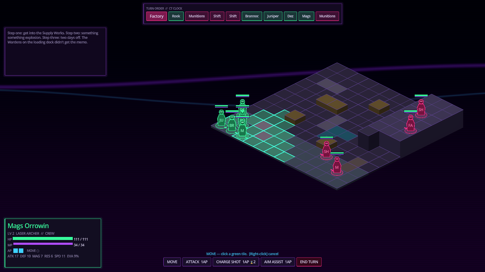
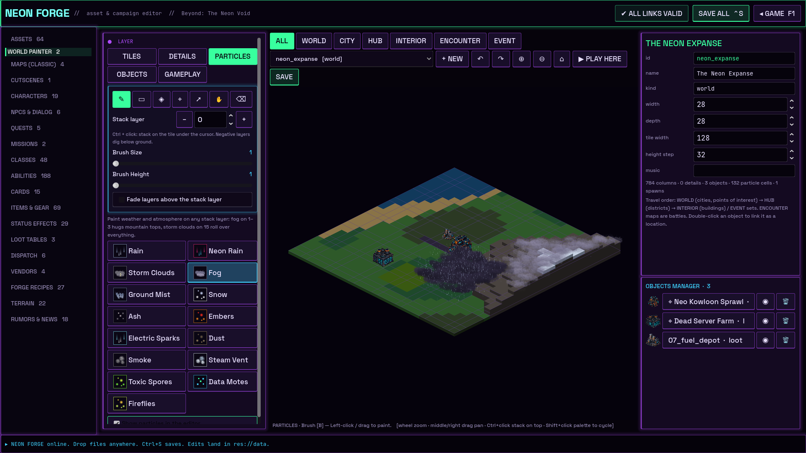
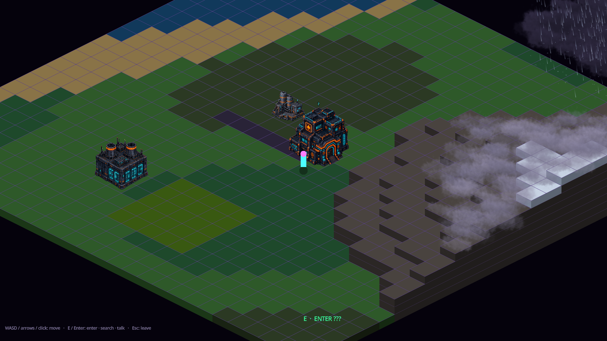

# Beyond: The Neon Void

A cyberpunk turn-based tactics RPG: a spiritual successor to *Final Fantasy Tactics*, set in the world of **The Black Doctrine**. Built with **Godot 4.7.2** and GDScript.



## Start here

1. Install **Godot 4.7.x** (standard build, not .NET).
2. Clone this repo, open Godot, then **Import** and pick `project.godot`. The first open imports assets, which takes a minute.
3. Press **F5**. From the title screen you can pick:
   - **New Shift**: the campaign loop (bar hub → job board → battle → rewards).
   - **Quick Battle**: jump straight into *The Brew Plan*.
   - **Neon Forge (F1)**: the in-game asset & campaign editor.

### Battle controls
| Input | Action |
|---|---|
| Left-click | Move / target / search scenery next to your unit |
| Right-click / Esc | Cancel |
| Command bar | Move, abilities (costs shown), End Turn |
| T / M / Tab | End turn / move mode / threat map |
| WASD, middle-drag, wheel | Camera |
| F5 / F9 | Quick save / quick load |

### Neon Forge (the editor)
- Edits land in `data/*.json` and `assets/`, so every change is a git diff.
- Drop files **anywhere on the window** and the **intake wizard** asks what each one is (tile, detail, structure, prop, character, item...), what to call it, and its role. It then *copies* the file into the right `assets/` folder and indexes it in `data/asset_index.json`. Your originals are never moved.
- **World Painter** (the live level builder, [format](docs/design/WORLD_FORMAT.md)):
  - Tabs for **world / city / hub / interior / encounter / event** maps.
  - **Tiles** stack at any layer, including negative (below ground). Tools: brush **B**, rectangle **R**, fill **G**, eyedropper **I**, select **V**, pan **H**, erase **E**. Brush size slider; tiles land only on the chosen stack layer ("Solid column" fills below for cliffs). Shift-click tiles in the palette to cycle through them while you paint. A green ghost shows where tiles will land.
  - Tile art auto-fits to the world angle. Numbered water/river frames play as animations.
  - Other layers: **Details** (craters, debris, rivers laid on top of tiles), **Particles** (rain, storm clouds, fog... on any layer), **Objects** (with animation speed and loop/ping-pong), **Gameplay** (spawns, enemies, cover).
  - Double-click an object to make it a **location**: a city or point of interest that links to another map, with a first-visit cutscene.
  - **▶ Play here** (F5) walks the map, or fights on it if it's an encounter.
- **Characters:**
  - Drop a portrait or an animation sheet on the character's drop zone.
  - The slicer turns sheet rows into idle/walk/attack/hurt/death animations.
  - **▶ Playtest** puts that character straight into a fight.
- **Maps (classic):** the older flat painter, still works for old maps.
  - Paint terrain (including your own registered tile art) and sculpt height.
  - Set cover, spawns and enemy encounters.
  - Place props with hidden loot and popup text (FF8/FF9-style).
- **Every other content type** is edited with forms: classes, abilities, cards, items, statuses, NPCs & dialog (with voice lines), quests, missions and win conditions, loot, dispatch, vendors, recipes, terrain and rumours.
- **Shortcuts:** Ctrl+S saves · Ctrl+N new · Ctrl+D duplicate · Ctrl+F search · Ctrl+Enter playtest.




## Where things are
```
project.godot            Godot 4.7 project (Forward+, HDR 2D glow)
src/autoload/            Singletons: EventBus, ContentDB, ClassLibrary, GameManager,
                         CombatManager, CampaignManager, QuestManager, SaveManager, ...
src/combat/              Unit, UnitStats, TurnQueue (FFT CT), DamageCalculator,
                         JobHandler, EquipmentManager, abilities/, ai/
src/grid/                IsometricGrid (data), BattleMap (scene), TileView, highlights
src/data/                Content Resource classes (JSON <-> Resource)
src/ui/  src/world/      HUDs, menus, hub, dialogue
src/tools/               Neon Forge editor
data/                    ALL game content as JSON (edited by Neon Forge)
assets/                  tiles/ structures/ props/ units/ portraits/ ui/ music/ sfx/ voice/ vfx/ fonts/
tests/                   Headless test suite + screenshot renderer
tools/cutscene_builder/  Parallax cutscene builder (open cutscene-builder.html in a browser)
data/cutscenes/          Exported .parallax.json cutscenes
docs/                    Lore digest, research, design (classes, big ideas), migration notes
legacy/original_gd/      The original prototype scripts (ignored by Godot)
```

## Docs
- `docs/design/CLASSES.md`: all 35 classes, unlock tree and abilities.
- `docs/design/BIG_IDEAS.md`: genre-pushing mechanics, ranked, with build status.
- `docs/lore/LORE_DIGEST.md`: world reference, canon usage tags, contradictions to resolve.
- `docs/research/GODOT_AND_TRPG_RESEARCH.md`: Godot 4.2→4.7 notes and the tactics-genre survey.
- `docs/MIGRATION.md`: where every original script went, and what was fixed.

## Tests
```
godot --headless --path . --import
godot --headless --path . -s res://tests/compile_all.gd    # every script compiles
godot --headless --path . -s res://tests/run_tests.gd      # 270+ checks + 36 AI-vs-AI battles
```

## Adding your assets
Put files in the matching `assets/` folder, or drop them onto the Neon Forge window:

| Asset | Folder |
|---|---|
| Black Doctrine structures | `assets/structures/` |
| Ground tiles (`god_tiles`) | `assets/tiles/` (then **Register as terrain** in Forge → Assets) |
| UI | `assets/ui/` |
| HUD (`doctrine/green-purple`) | `assets/ui/hud/` |
| Music | `assets/music/` |
| Your SFX | `assets/sfx/` |

Music is referenced by file name (without extension) in a mission's `music_id`, for example `battle_supply_works.ogg`.

---

## Original brief
A turn based tactics RPG akin to FF Tactics in a cyberpunk world. Set in the same world of Black Doctrine, a place where everything has two truths... and both are likely wrong. I truly want it to feel like a spirital successor to 
final fantasy tactics but with its own charm and moments to stand out as something more. this is a very dark and mature toned game but at the same time the awkward humor is the linchpin to keep it from a completely 
depressing venture. a group of friends of whom only found freindship in a gluttonous amount of brew consumption and mutal disdain for the strict Iron fisted rule of the totalitarian ruling power known as the black doctrine. a Gov't power that has little pity towards its people and so life is truly grueling existence for some. the lucky ones die at an early enough age that they arent tainted and turned fowl from the mental slavery that comes from 15 hour work days and only having 3 days off a month. the montley cast of fowl mouthed wishful thinkers and iron belly drinkers devise a plan to break into a black doctrine munitions supply factory and perhaps accidentally cause an explosion thats perhaps just big enough that if successful not only would it leave a little scratch on the doctrines warmachine and its pride but also give them an extra day or two to drink as the chaos and dust clears. think the show "cheers" mixed with cyberpunk and a hint of fight club. but what was supposed to be a self made 2 day hopeful vaction takes a huge turn when the would be drunken heroes stumble or better said, fall into what can only be decribed as a human essence factory. where the essence of humans are extracted in a gruesome manner to feed and empower a little known at the time, black doctrine digimancer. havng existed in a world curated by the doctrine he has convinced himself and those around him that he could truly awaken the digital queen and rule with a digital fist by her side and herolded as the leader of the new age of humans. an age where a culling of the population would become common place and eventually would allow this digimancer infinite power. 


Notes to Claude before starting. 
 
1. Architectural Summary
•	Pattern: The game uses a Singleton-driven orchestration layer (GameManager, CombatManager, SceneManager) and a composition-based unit system.
•	The Class System: A Resource-driven bridge. ClassResource (Data) $\rightarrow$ ClassLibrary (Registry) $\rightarrow$ UnitStats (Calculator) $\rightarrow$ Unit (Entity).
•	Combat Loop: Turn-based, isometric grid-based movement and action resolution handled by CombatManager and JobHandler.
•	Ability System: Logic is decoupled into specialized scripts (Kinetic, Time, Terrain) which are called as resources by the JobHandler.
2. Technical Specifications
•	Engine: Godot 4.2 (GDScript) but none of the actual engine work is done only .gd coding. i want it gone over and corrected to be built in the newest version of godot instead of 4.2. so do all the research you need to and disect the files so we can actually get a good head start on the game. once you got a good footing i want you to develop an asset/ campaign editor that has a really juiced up interface and features while staying as a source for me to inject into the game while you code and do other things needed or wanted. the editor should not only be imedititly intuitive and somw what enjoyable to use but it needs to be an item and asset manager where i can drop in ground tiles/ name them and then place them, props and building assets with interactivity options and trigger options and a by asset basis be able to place a prop down and allow me to attach an item to it as discoverable loot and a dialog box if i want to add a quick pop up text when something is or isnt discovered so theres a system kind of like ff8 and ff9 where items are placed in random unmarked places and encourace checking every asset. also let me add characters by dragging and dropping character sheets and animation sheets into the editor window which then lets me create the name/class/ adjust the character stats if needed/ assign class and starting abilities/ starting gear and gear and weapon type that the character specializes in and when wearing gets a slight stat boost and abilities experince increase/ also allow me to choose if its a vendor or not and if so is given stats and gear as well for a quest late game where you can fight him/ a place to curate his inventory and costs and item names and items specs in general along with eaves drop and dialog sections and also audio lines that i either record myself or curate using eleven labs or something like that. and the same creation options should be made for npc's and if they are what an asset thats dropped in is assigned to. along with a quest section just in case a npc or vendor gives out a quest or two or a chain with prequisite conditions and what it takes for completion and whats rewarded. and the same for the weapons smith and armor vendor and card dealer( theres a class that uses cards with once a battle uses for each card and instead of equiping the character with the card class with a weapon you instead build him a deck of cards that are used instead). there should be a dispatch quest system like in fft A2 where you can choose a party member to be sent out on an auto quest thats timers based and uses some kind of stats under the hood that decides it success. and with a successful return you are awarded currency(soul coins) and a mixed variety of restoration items, crafting mats for weapons and gear, and possibly even some actual weapons and gear. and some of the crafting mats are junk items while others are actually useful for crafting more than just restoration potions but instead are used to upgrade gear and weapons, then once a weapon or piece of gear reaches level 10 it can be combined and craffted with uncommon crafting mats at lower levels and rare/super mats at higher levels. and weapons keep leveling up and max at level 50, level 10 is just the base crafting ready level for each weapon. and crafting right away might give a slight boost in stats but wont be able to have as high of a max stat level compared to a weapon that waited to craft into a new weapon at level 20 or 30 or 50. class abilities are unlocked at a computer terminal using microchips that are found on the bodies of defeats enemies and post battle rewards and are. the companion editor should also let me apply particles and effects that ill have you create eventually along with scene music. and also let medesign encounters and win conditions. ill stop there for now so you can get to work and hopefully are able to tackle this, dont be afraid to sign smaller agents to some of the smaller tasks so not all of your credits are being drained on simple tasks that can be delegated out. i have to go work on my other game the black doctrine now so ill come check in soon to see how things are going or if theres any questions. also ill gather some ground textures characters with animations and some assets so we can do some testing when we need to before the full swing.
•	Key Logic: Stat scaling is multiplicative based on the chosen ClassResource. Movement uses CharacterBody2D with a custom IsometricGrid coordinator.
•	State Management: The game relies on a global GameManager to track progression and SaveManager for JSON-based persistence.
3. Current Project Status
•	Completed: The structural blueprint, the 19-class hierarchy, the stat-scaling bridge, and the core combat orchestration logic.
•	Pending: Fine-tuning of individual ability values, expanded AI behavior trees (beyond the basic Cautious/Aggressive scripts), and final UI polish for the UnitHUD.
4. Directives for claude
•	"Review the UnitStats scaling logic to ensure no overflow or rounding errors."
•	"Expand the AIBehavior system to include tactical positioning based on the IsometricGrid."
•	"Verify that all Ability resources are correctly mapped to the 19 classes in the ClassLibrary."

Help me set up the Godot project and flesh out these scripts."
Claude will handle creating the actual Godot project file and integrating your existing code.
is there anything i can do beforehand or need to do to be able to use the code and get it working for the updated godot?
Good question! Godot 4.2 to 4.7 is a fairly minor version bump, so your code will likely work with minimal or no changes. Here's what you should know:
Before You Start
The safest approach: Just upload your code as-is and let Claude handle the compatibility check. He can:
1.	Identify any breaking changes between 4.2 and 4.7
2.	Update deprecated syntax or APIs
quick last note. the story pages i think there were three of them are for reference to the world and setting, this game is based in that world but that is strucutred in a way that it may seem like we are using those characters but in our game here they are merely referenced or are over heard or spoken about as if we are just hearing the eaves dropping of rumors or are referenced in a way to make the entire series feel like a whole but this really is a self contained story in the same world and only possibly will there be one or two cameos in the form of npc's that come from the black doctrine game. the war is in full swing and isnt even resolved by the time our story here will end. so its like hearing the news station on tv talk about an overseas war going on while the citizens here are dealing with their day to day harsh lives and really most with the exception of a few even pay any attenion to whats happening.
