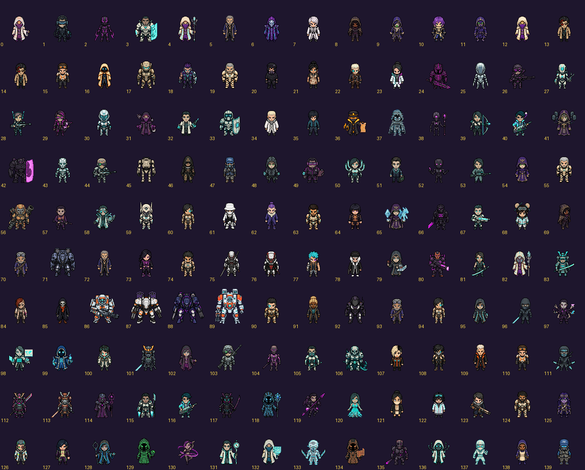

# Cast reference sheet

The south-facing reference shots in `assets/units/full cast of characters so far south facing for reference/`,
numbered as on the sheet below. Fill in **name / role** for the ones you know (crew, class, enemy, boss, NPC) and
Claude renames the files and hooks them up as portraits and turn-order icons. Leave a row blank to skip it.

| # | file | name / role |
|---|---|---|
| 0 | `sprite_1 - 2026-10-08T072248.101.png` |  |
| 1 | `sprite_1 - 2026-10-08T072351.669.png` |  |
| 2 | `sprite_1 - 2026-10-08T072447.198.png` |  |
| 3 | `sprite_1 - 2026-10-08T072527.225.png` |  |
| 4 | `sprite_1 - 2026-10-08T072554.701.png` |  |
| 5 | `sprite_1 - 2026-10-08T072701.963.png` |  |
| 6 | `sprite_1 - 2026-10-08T072710.978.png` |  |
| 7 | `sprite_1 - 2026-10-08T072724.825.png` |  |
| 8 | `sprite_1 - 2026-10-08T072732.152.png` |  |
| 9 | `sprite_1 - 2026-10-08T072746.290.png` |  |
| 10 | `sprite_1 - 2026-10-08T072754.017.png` |  |
| 11 | `sprite_1 - 2026-10-08T072808.547.png` |  |
| 12 | `sprite_1 - 2026-10-08T072815.668.png` |  |
| 13 | `sprite_1 - 2026-10-08T072836.153.png` |  |
| 14 | `sprite_1 - 2026-10-08T072902.840.png` |  |
| 15 | `sprite_1 - 2026-10-08T072917.950.png` |  |
| 16 | `sprite_1 - 2026-10-08T072942.281.png` |  |
| 17 | `sprite_1 - 2026-10-08T073137.842.png` |  |
| 18 | `sprite_1 - 2026-10-08T073230.108.png` |  |
| 19 | `sprite_1 - 2026-10-08T073325.647.png` |  |
| 20 | `sprite_1 - 2026-10-08T073355.476.png` |  |
| 21 | `sprite_1 - 2026-10-08T073457.676.png` |  |
| 22 | `sprite_1 - 2026-10-08T073625.108.png` |  |
| 23 | `sprite_1 - 2026-10-08T073736.488.png` |  |
| 24 | `sprite_10 - 2026-10-08T072246.038.png` |  |
| 25 | `sprite_10 - 2026-10-08T072349.353.png` |  |
| 26 | `sprite_10 - 2026-10-08T072449.912.png` |  |
| 27 | `sprite_10 - 2026-10-08T072529.550.png` |  |
| 28 | `sprite_10 - 2026-10-08T072622.515.png` |  |
| 29 | `sprite_11 - 2026-10-08T072245.102.png` |  |
| 30 | `sprite_11 - 2026-10-08T072348.116.png` |  |
| 31 | `sprite_11 - 2026-10-08T072451.953.png` |  |
| 32 | `sprite_11 - 2026-10-08T072530.759.png` |  |
| 33 | `sprite_11 - 2026-10-08T072624.339.png` |  |
| 34 | `sprite_11 - 2026-10-08T072845.143.png` |  |
| 35 | `sprite_11 - 2026-10-08T073737.970.png` |  |
| 36 | `sprite_12 - 2026-10-08T072243.561.png` |  |
| 37 | `sprite_12 - 2026-10-08T072346.907.png` |  |
| 38 | `sprite_12 - 2026-10-08T072453.840.png` |  |
| 39 | `sprite_12 - 2026-10-08T072531.938.png` |  |
| 40 | `sprite_12 - 2026-10-08T072617.176.png` |  |
| 41 | `sprite_13 (100).png` |  |
| 42 | `sprite_13 - 2026-10-08T072440.703.png` |  |
| 43 | `sprite_13 - 2026-10-08T072509.971.png` |  |
| 44 | `sprite_13 - 2026-10-08T072615.865.png` |  |
| 45 | `sprite_13 - 2026-10-08T073331.607.png` |  |
| 46 | `sprite_13 - 2026-10-08T073400.768.png` |  |
| 47 | `sprite_13 - 2026-10-08T073744.065.png` |  |
| 48 | `sprite_14 (87).png` |  |
| 49 | `sprite_14 (88).png` |  |
| 50 | `sprite_14 (89).png` |  |
| 51 | `sprite_15 (75).png` |  |
| 52 | `sprite_15 (76).png` |  |
| 53 | `sprite_15 (77).png` |  |
| 54 | `sprite_15 (78).png` |  |
| 55 | `sprite_15 (79).png` |  |
| 56 | `sprite_16 (86).png` |  |
| 57 | `sprite_16 (87).png` |  |
| 58 | `sprite_16 (88).png` |  |
| 59 | `sprite_17 (59).png` |  |
| 60 | `sprite_17 (60).png` |  |
| 61 | `sprite_17 (61).png` |  |
| 62 | `sprite_19 (57).png` |  |
| 63 | `sprite_19 (58).png` |  |
| 64 | `sprite_19 (59).png` |  |
| 65 | `sprite_2 - 2026-10-08T072352.860.png` |  |
| 66 | `sprite_2 - 2026-10-08T072445.953.png` |  |
| 67 | `sprite_2 - 2026-10-08T072526.020.png` |  |
| 68 | `sprite_2 - 2026-10-08T072718.340.png` |  |
| 69 | `sprite_2 - 2026-10-08T072735.803.png` |  |
| 70 | `sprite_2 - 2026-10-08T072801.504.png` |  |
| 71 | `sprite_2 - 2026-10-08T073105.497.png` |  |
| 72 | `sprite_21 (42).png` |  |
| 73 | `sprite_21 (43).png` |  |
| 74 | `sprite_23 (43).png` |  |
| 75 | `sprite_25 (43).png` |  |
| 76 | `sprite_25 (44).png` |  |
| 77 | `sprite_25 (45).png` |  |
| 78 | `sprite_27 (30).png` |  |
| 79 | `sprite_3 - 2026-10-08T072354.018.png` |  |
| 80 | `sprite_3 - 2026-10-08T072444.481.png` |  |
| 81 | `sprite_3 - 2026-10-08T072524.627.png` |  |
| 82 | `sprite_3 - 2026-10-08T072553.186.png` |  |
| 83 | `sprite_3 - 2026-10-08T072619.462.png` |  |
| 84 | `sprite_3 - 2026-10-08T072923.755.png` |  |
| 85 | `sprite_3 - 2026-10-08T072945.283.png` |  |
| 86 | `sprite_3 - 2026-10-08T073016.203.png` |  |
| 87 | `sprite_3 - 2026-10-08T073028.278.png` |  |
| 88 | `sprite_3 - 2026-10-08T073038.118.png` |  |
| 89 | `sprite_3 - 2026-10-08T073052.178.png` |  |
| 90 | `sprite_3 - 2026-10-08T073458.696.png` |  |
| 91 | `sprite_33 (31).png` |  |
| 92 | `sprite_34 (28).png` |  |
| 93 | `sprite_36 (22).png` |  |
| 94 | `sprite_39 (17).png` |  |
| 95 | `sprite_4 - 2026-10-08T072325.760.png` |  |
| 96 | `sprite_4 - 2026-10-08T072355.548.png` |  |
| 97 | `sprite_4 - 2026-10-08T072443.010.png` |  |
| 98 | `sprite_4 - 2026-10-08T072523.007.png` |  |
| 99 | `sprite_4 - 2026-10-08T072618.158.png` |  |
| 100 | `sprite_41 (18).png` |  |
| 101 | `sprite_5 - 2026-10-08T072220.572.png` |  |
| 102 | `sprite_5 - 2026-10-08T072250.375.png` |  |
| 103 | `sprite_5 - 2026-10-08T072356.766.png` |  |
| 104 | `sprite_5 - 2026-10-08T072441.767.png` |  |
| 105 | `sprite_5 - 2026-10-08T072521.740.png` |  |
| 106 | `sprite_5 - 2026-10-08T072611.779.png` |  |
| 107 | `sprite_5 - 2026-10-08T072921.898.png` |  |
| 108 | `sprite_5 - 2026-10-08T073359.134.png` |  |
| 109 | `sprite_5 - 2026-10-08T073628.187.png` |  |
| 110 | `sprite_5 - 2026-10-08T073740.452.png` |  |
| 111 | `sprite_6 - 2026-10-08T072221.930.png` |  |
| 112 | `sprite_6 - 2026-10-08T072322.900.png` |  |
| 113 | `sprite_6 - 2026-10-08T072343.661.png` |  |
| 114 | `sprite_6 - 2026-10-08T072433.668.png` |  |
| 115 | `sprite_6 - 2026-10-08T072520.292.png` |  |
| 116 | `sprite_6 - 2026-10-08T072612.758.png` |  |
| 117 | `sprite_7 - 2026-10-08T072251.762.png` |  |
| 118 | `sprite_7 - 2026-10-08T072342.380.png` |  |
| 119 | `sprite_7 - 2026-10-08T072435.074.png` |  |
| 120 | `sprite_7 - 2026-10-08T072519.044.png` |  |
| 121 | `sprite_7 - 2026-10-08T072842.653.png` |  |
| 122 | `sprite_7 - 2026-10-08T072925.563.png` |  |
| 123 | `sprite_7 - 2026-10-08T073233.333.png` |  |
| 124 | `sprite_7 - 2026-10-08T073327.776.png` |  |
| 125 | `sprite_7 - 2026-10-08T073357.879.png` |  |
| 126 | `sprite_7 - 2026-10-08T073629.828.png` |  |
| 127 | `sprite_7 - 2026-10-08T073742.072.png` |  |
| 128 | `sprite_8 - 2026-10-08T072252.641.png` |  |
| 129 | `sprite_8 - 2026-10-08T072340.986.png` |  |
| 130 | `sprite_8 - 2026-10-08T072436.314.png` |  |
| 131 | `sprite_8 - 2026-10-08T072517.847.png` |  |
| 132 | `sprite_8 - 2026-10-08T072614.594.png` |  |
| 133 | `sprite_9 - 2026-10-08T072247.110.png` |  |
| 134 | `sprite_9 - 2026-10-08T072350.539.png` |  |
| 135 | `sprite_9 - 2026-10-08T072448.687.png` |  |
| 136 | `sprite_9 - 2026-10-08T072528.467.png` |  |
| 137 | `sprite_9 - 2026-10-08T072621.269.png` |  |
| 138 | `sprite_9 - 2026-10-08T072837.846.png` |  |
| 139 | `sprite_9 - 2026-10-08T073502.688.png` |  |
