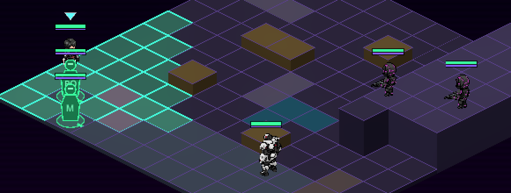
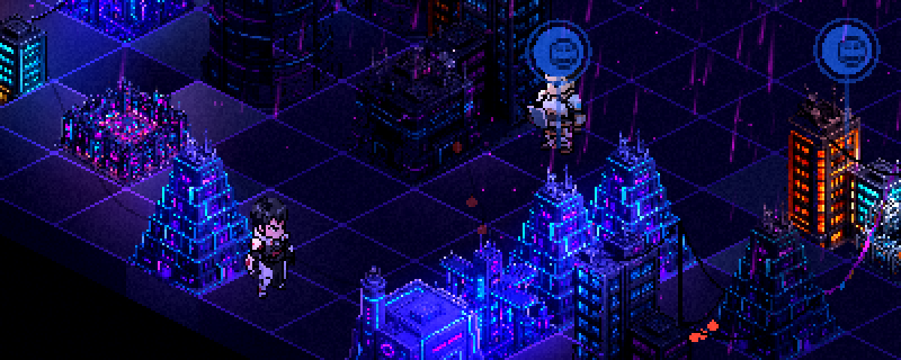

# PixelLab units

Drop a character's PixelLab export zips into one folder under `assets/units/` (e.g.
`assets/units/test_enemy_001/`) and point a character's **sprite_frames_path** at that
folder (CHARACTERS tab). The game unpacks the zips once into `<folder>/extracted/` and
builds the unit from them (`src/vfx/pixel_lab.gd`). No renaming and no sprite sheets
needed.




## How animations become actions
Each animation is matched by its name (then its state's name):

| Action | Words it looks for |
|---|---|
| walk | walk, stride, march, step |
| run (stands in for walk if there is none) | run, sprint, dash |
| attack | shoot, gun, fire, blast, attack, kick, uppercut, punch, slash, swing, strike, wind-up |
| hit | taking_hit, hurt, flinch, knockback |
| cast (heals, items, buffs) | heal, item, potion, cast, spell |
| idle | idle, breath, standing, looking, tablet |
| jump, wave, death | jump/leap · wave · death/dying/collapse |

- **Facings:** animations come in the four diagonals, which are exactly the battle facings. The eight still poses fill idle for every direction.
- **Poses without an animation:** an export like "shooting" that is only still poses becomes a one-frame version of its action.
- **Extra animations:** anything not picked keeps its own name (`roundhouse_kick`, `uppercut`…). Set an ability's **anim** field to play it (e.g. `tx_roundhouse_kick` → `roundhouse_kick`).

## Overrides: `pixellab.json` in the character's folder
```json
{"actions": {"walk": "walking_forward/Walking", "attack": "attack_kick/Roundhouse_Kick"},
 "fps": 10, "fps_by_action": {"walk": 12}, "loop": {"attack": false}, "scale": 1.5}
```
Values are `state/Animation` folder names from the export. `scale` is the size on a
128-wide tile (1.5 by default, so ~60 px art stands ~90 px tall).

## Placing characters on maps
An object whose **asset** is a PixelLab folder stands there animated. Its `facing` (SE/SW/NE/NW) and
`unit_anim` (default idle) say which way it faces and what it plays. Kade on the Neon Block is one.
Add an NPC anchor on the same cell to make them talk or trade.

## Test content
- **Test Runner** (`test_hero`): gunslinger.
- **Bulwark Brawler** (`test_enemy_001`): kick with knockback, uppercut, force blast.
- **Corp Gunner** (`test_enemy_002`): rifle and Field Patch.
- **Kade** (`kade`): vendor; shop `test_vendor`.
- **Main menu:** **TEST UNITS — SKIRMISH** and **TEST UNITS — WALK THE NEON BLOCK**.
- **Rebuild:** `python3 tools/demo/make_test_units.py` rebuilds the mission, Kade and his spot on the map.
