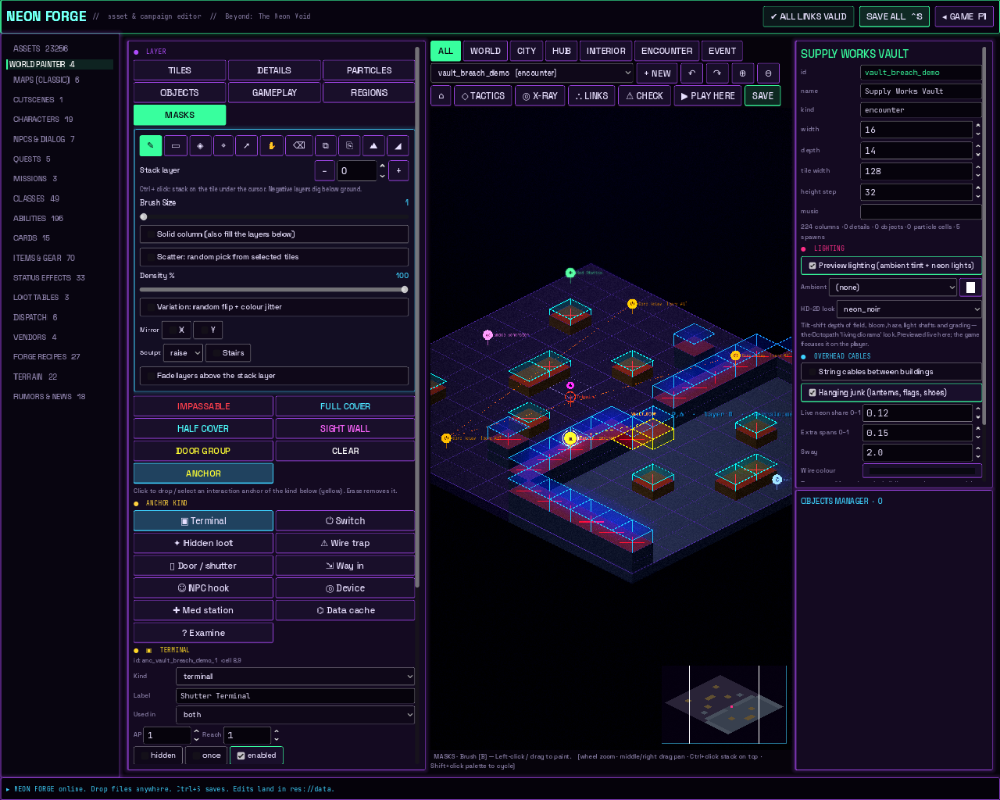
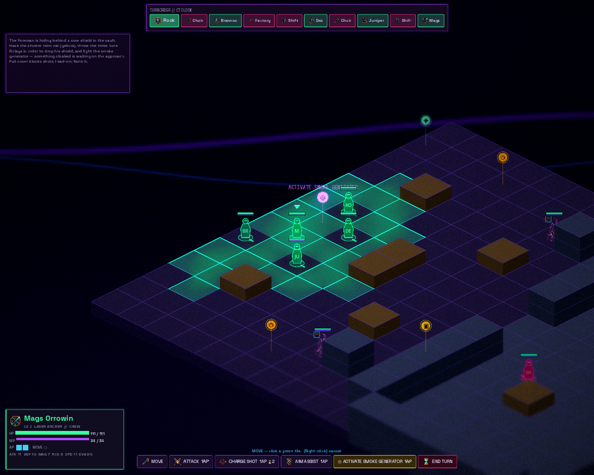

# Tactical masks and interaction anchors

The World Painter's **MASKS** tab paints battle rules onto the diamond grid and
drops **interaction anchors**: the yellow pins for terminals, switches, hidden
loot, wire traps, doors, NPC hooks and more. Explore maps use the same data, so
one brush marks "a building stands here, don't walk through it" and the same
anchor works in a fight or on a walk.

## Mask brushes

| Brush | What it does | Overlay |
|---|---|---|
| **IMPASSABLE** | Nobody stands on or walks through the cell. On city, hub and interior maps, use it for cells a building or prop covers. **FOOTPRINTS → IMPASSABLE** does every structure on the map in one click. | red ✕ |
| **FULL COVER** | Tall cover. Blocks **100%** of shots coming straight across it (no line of sight) and **66%** from the side angles. | tall cyan box |
| **HALF COVER** | Low cover. **50%** head-on, **25%** from the side. | short teal box |
| **SIGHT WALL** | Blocks line of sight for every ability (glass, smoke stacks) without stopping movement. | violet eye |
| **DOOR GROUP** | Tags cells with a group name (e.g. `vault_door`). They start sealed (impassable + full cover). An `open` / `toggle` action clears them, and objects with the same **mask_group** (object inspector) fade out. | yellow outline + name |
| **CLEAR** | Wipes every mask from the cell. | |
| **ANCHOR** | Click to drop (or select) an anchor of the chosen kind. Click again on a stack to cycle through it; erase removes it. | yellow pin |

### How cover works out (`IsometricGrid.cover_fraction`)
Each cover cell next to the target is judged by where the shot comes from:

- **Head-on**: the attacker sits within about 22° of straight across the cover.
  Full cover gives 1.0, which means no line of sight and a hit chance of 0. Half cover gives 0.5.
- **Side angle**: full cover gives 0.66, half cover gives 0.25.
- **Behind or open side**: 0.
- Melee (adjacent) ignores cover. Shooting from 3+ levels above halves it.
- Terrain 2+ levels higher than the target counts as full cover; 1 level higher counts as half.

Cover is turned into numbers in `DamageCalculator`: hit chance drops by `cover × 45%` and damage by
`cover × 40%`. So half cover head-on costs about 23% hit and 20% damage, and full cover from the side
costs 30% hit and 26% damage. Tech/magic ignores cover unless it is a full wall head-on.
The forecast shows **"Target in cover: N%"** or **"BLOCKED BY COVER"**. The AI flanks walls it can't
shoot through instead of camping behind them.

## Anchor kinds
| Kind | Default | Notes |
|---|---|---|
| ▣ Terminal | 1 AP, `toggle <door group>` | Hackable mid-fight. |
| ⏻ Switch | 1 AP, `toggle` | Give several the same **sequence** + steps 1, 2, 3… to make an order puzzle. |
| ✦ Hidden loot | hidden, once, stand on it | Shows no marker; standing on it offers "SEARCH HERE". |
| ⚠ Wire trap | hidden, once | Goes off when the side it's wired against walks over it (damage + status). Once revealed: click to **disarm** (chance) or **Shift+click to rewire** it against the enemy. |
| ▯ Door / shutter | `toggle` | |
| ⇲ Way in | explore only, stand on it | `teleport` or `battle`: walk into a building or start a fight. |
| ☺ NPC hook | free | Runs the NPC's **interaction stages** (below). |
| ◎ Device | `reveal` | Smoke / scanner: strips **cloaked** and hidden from units, and reveals hidden anchors. |
| ✚ Med station, ⌬ Data cache, ? Examine | heal 40%, +1 chip, a line of text | |

Every anchor also has: label, **used in** (both / battle / explore), AP cost, reach (0 = stand on it,
1 = next to it), hidden, once, enabled (offline until another anchor `enable`s it), needs flag,
needs item (optionally used up, e.g. a keycard), sequence + step, **when used** actions and
**wrong order** actions.

### Actions
`open` `close` `toggle` (door group) · `reveal` (radius) · `unshield` (character id or everyone) ·
`status` / `cleanse` (`status@self|allies|enemies|all|boss`) · `give` / `take` (`item:qty`) · `coins` ·
`chips` · `damage` / `heal` (`25` or `25%`) · `ap` · `spawn` (`character@x,y[@enemy|player]`) ·
`flag` / `unflag` · `enable` / `disable` / `arm` (another anchor) · `toast` · `news` (ticker and signage) ·
`cue` · `dialog` · `npc` · `cutscene` · `battle` · `teleport` (`map`, `map:spawn` or `x,y` on this map) · `music`.

### Boss mechanics
Give the boss the **shielded** status (GAMEPLAY tab → Enemy → "Starts with"; it's untouchable).
Put `unshield <boss id>` on the last switch of a sequence. Pressing a switch out of order resets the
sequence and runs the switch's wrong-order actions (the demo uses a 10% shock). **cloaked** enemies
can't be hit from range, and melee lands half as often, until a smoke device or scanner clears them.

## NPC interaction stages (NPCS tab → "Interaction stages")
The anchor only switches the NPC on. What they do lives on the NPC:

1. **First meeting:** `intro_lines`, or the dialog graph if those are empty (choices work).
2. **Gift:** `give_item_id` × `give_item_qty`, once.
3. **After the talk** (`after_talk`):
   - `shop`: the vendor's stock pops up
   - `quest`: offer, remind, then turn in `offer_quest_id`
   - `chain`: offer `chain_quest_id` once `chain_requires` holds (`flag`, `quest:<id>`, `mission:<id>`, `item:<id>:<n>`), otherwise `chain_locked_lines`
   - `fetch`: `fetch_items` {item: qty}, a reward for each return, and a reward on completion
   - `battle`: `fight_mission_id`
   - `cutscene`: `stage_cutscene`
4. **Repeat:** on later visits with nothing left to do, `repeat_lines` cycle.
5. **Closing:** `closing_lines`, said before a battle or cutscene starts.

Progress is kept in story flags (`npc:<id>:met`, `:gift`, `:fetch`, `:fetched`).

## Runtime
- `src/world/interactions.gd` holds the anchor schema, the action runner, sequences, traps, door groups and saved state.
- `src/world/anchor_marks.gd` draws the pins.
- `src/world/npc_stages.gd` runs NPC stages. `src/ui/shop_popup.gd` is the shop pop-up.
- **Battle** (`battle_map.gd`): INTERACT buttons for anchors in reach; click a pin; traps fire along a unit's path.
- **Explore** (`explore_scene.gd`): **E** uses the nearest anchor; open doors and used anchors are remembered per map.

## Demo
- **Vault Breach** (`demo_vault_breach`, map `vault_breach_demo`): shutter terminal, three Core Relays, a
  shielded Foreman, cloaked Choir Enforcers, a smoke generator, a tripwire, hidden loot, a med station
  and a data cache.
- **Neon Block demo:** Ma Rivet, a fetch quest (3 scrap wire, 2 dead batteries; the storm drain at 0,7
  hides both), and a way into the Vault Breach battle.
- Regenerate both with `python3 tools/demo/make_tactics_demo.py`. Run it again after
  `make_block_demo.py`, which rewrites the Neon Block map.
